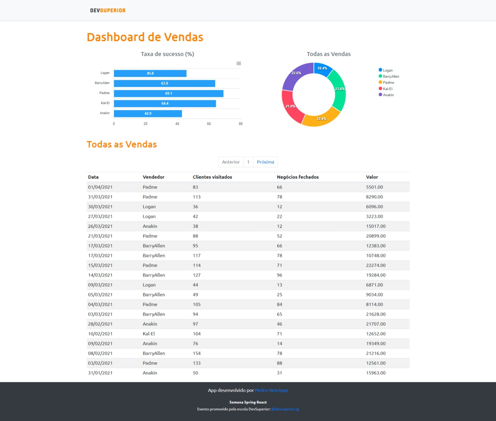

# DsVendas
## :book: About
[Open on netlify](https://dsvendas-ds3.netlify.app/dashboard) <br />
Project developed during Semana DevSupeior (SDS3). The application consists in a sales dashboard.

## :rocket: Main technologies
### Frontend:
* [ReactJS](https://pt-br.reactjs.org/)
* [TypeScript](https://www.typescriptlang.org/)
* [ApexCharts](https://apexcharts.com/)
* [Bootstrap](https://getbootstrap.com/)
* [Axios](https://github.com/axios/axios)


### Backend:
* [Java 11](https://www.java.com/pt-BR/)
* [Spring Boot](https://spring.io/projects/spring-boot)
* [Hibernate](https://hibernate.org/)

## :thread: Implementation
* Frontend: Netlify
* Backend: Heroku
* Database: PostgreSQL

## :computer: Layout


## 🔌 Running the project
### Backend:
To run the backend of the you must have installed on your computer the following technologies:
* [Git](https://git-scm.com)
* [PostgreSQL](https://www.postgresql.org/)
* [Java 11](https://www.java.com/pt-BR/)

```bash
  # Clone the repository.
  $ git clone https://github.com/phb2000/DsVendas.git
  
  # Go to the project folder using cmd
  $ cd DsVendas/backend
  
  #execute
  ./mvnw spring-boot:run
```
### Frontend: 
To run the frontend of the you must have installed on your computer the following technologies:
* [NodeJS](https://nodejs.org/en/)
* [Yarn](https://yarnpkg.com/)
* [Git](https://git-scm.com)

```bash
  
  # Go to the project folder using cmd
  $ cd ../frontend
  
  # Install the dependecies using the following command:
  $ yarn install
  
  # Start the application
  $ yarn start
```


